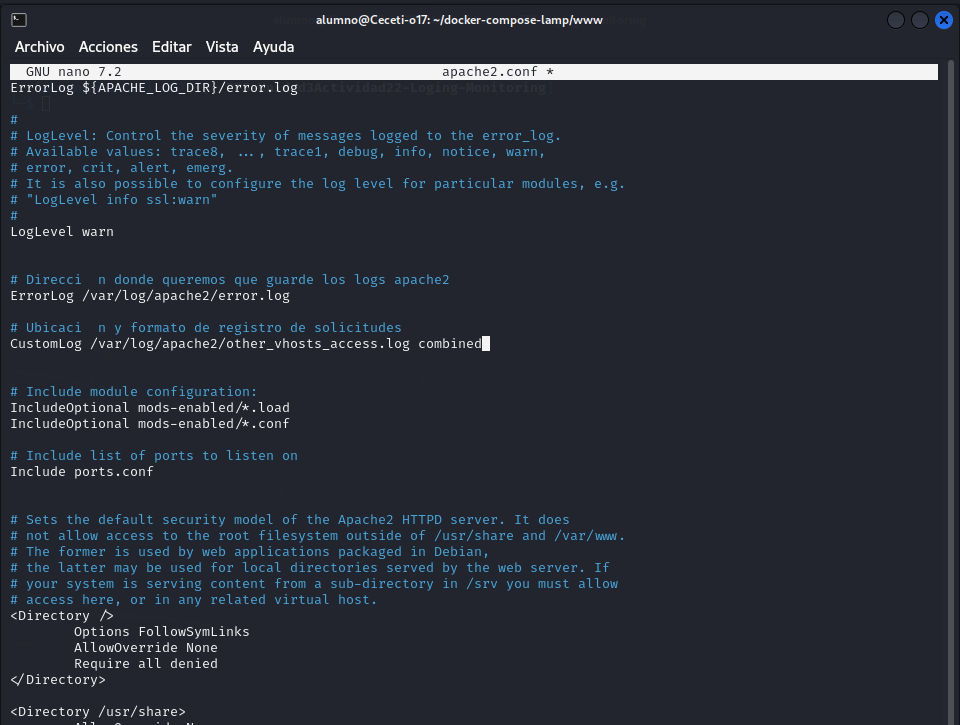

# PPS-Unidad3Actividad22-Loging-Monitoring
Registro y monitorización de eventos de seguridad. ELK 

Este actividad se corresponde con la actividad 22 del resultado de aprendizaje 3, tenemos el objetivo de __Implementar un sistema de logging y detección de eventos sospechosos__

---

# 1. ¿Qué es Logging & Monitoring?

Loggin y monitorign es el proceso de registrar y analizar eventos de seguridad en servidores y aplicaciones para detectar y responder a amenazas.

---

# 2. Configurar logs de eventos en Apache

archivo `/etc/apache2/apache2.conf`
```apache
# Nivel de segurdad elegimos
LogLevel warn

# Dirección donde queremos que guarde los logs apache2
ErrorLog /var/log/apache2/error.log
# Ubicación y formato de registro de solicitudes

CustomLog /var/log/apache2/other_vhosts_access.log combined
```

### Explicación de las diferentes directavas



- __LogLevel__

`LogLevel warn` define el nivel de detalle de los mensajes que Apache registra en los logs de error.

El valor de seguridad `LogLevel` puede tomar uno de estos valores:

|Nivel		        |Descripción
|-----------------------|---------------------------------------------------------------------|
|__emerg__ 		|Situaciones críticas que hacen que el servidor deje de funcionar.|
|__alert__		|Eventos graves que requieren atención inmediata.|
|__crit__		|Errores críticos en el servidor.|
|__error__		|Errores generales que no detienen el servidor.|
|__warn__		|Advertencias que pueden indicar problemas futuros. (Valor recomendado en producción)|
|__notice__		|Mensajes informativos importantes.|
|__info__		|Información detallada sobre la operación del servidor.|
|__debug__		|Información muy detallada para depuración.|
|__trace1 - trace8__ 	|Nivel de depuración más detallado (usado para desarrolladores).|


Si se cambia `LogLevel warn` a `LogLevel debug`, Apache registrará más detalles útiles para diagnóstico, pero puede generar archivos de log muy grandes.

- __ErrorLog ${APACHE_LOG_DIR}/error.log__

 `ErrorLog ${APACHE_LOG_DIR}/error.log` define la ubicación donde Apache guarda los logs de errores.


__Posibilidades adicionales__: Se puede redirigir los logs de error a un archivo específico o incluso a `syslog`:

`ErrorLog "|/usr/bin/logger -t apache_error"` enviaría los logs al sistema de logging de Linux.

__CustomLog ${APACHE_LOG_DIR}/other_vhosts_access.log combined__

`CustomLog /var/log/apache2/other_vhosts_access.log combined`  define la ubicación y el formato del archivo donde se registran las solicitudes de acceso al servidor.

Puede tomar uno de los siguientes valores:

|Formato 	 	|Descripción
|-----------------------|------------------------------------------------------------------------------------------|
|__combined__		|Formato extendido con más información (IP, fecha, agente de usuario, etc.). (Recomendado)|
|__common__		|Formato básico sin detalles de referer ni agente de usuario.|
|__vhost_combined__ 	|Similar a combined, pero muestra el VirtualHost asociado.|
|__json__		|Formato JSON estructurado.|
|__custom__		|Puedes definir tu propio formato personalizado.|


Ejemplo de un log en formato `combined`:

`192.168.1.10 - - [28/Feb/2025:12:34:56 +0000] "GET /index.html HTTP/1.1" 200 1024 "https://ejemplo.com" "Mozilla/5.0"`


Ejemplo de un log en formato `json`:

`CustomLog /var/log/apache2/other_vhosts_access.log "{ \"ip\": \"%h\", \"time\": \"%t\", \"request\": \"%r\", \"status\": %>s, \"size\": %b }" json`

Salida:

`{ "ip": "192.168.1.10", "time": "[28/Feb/2025:12:34:56 +0000]", "request": "GET /index.html HTTP/1.1", "status": 200, "size": 1024 }`


Reiniciar el servidor web cada vez que se modifique la configuración:

```bash
service apache2 restart
```

---

# 3. Detectar intentos de ataque en los logs

Como estamos trabajando con un escenario multicontenedor docker, hay algunas peculiaridades. Por ejemplo, parte de los logs se guardan en el archivo `other_vhosts_access.log` en vez de `access.log`. Si las consultas no dan resultados prueba con `access.log`.

__Monitorear logs en tiempo real con `tail -f`:__

```bash
tail -f /var/log/apache2/other_vhosts_access.log
tail -n 50 /var/log/apache2/error.log
```
__Mostrar los logs con paginación (para leer cómodamente)__

Si el archivo es muy grande less o more:

```bash
less /var/log/apache2/other_vhosts_access.log
```


__Buscar accesos a la página de administración__

Detectar intentos de acceso a rutas sensibles como /admin:

```bash
grep "admin" /var/log/apache2/other_vhosts_access.log
```


__Buscar intentos de ejecución de comandos en la URL__

Detectar posibles ataques de inyección de comandos:

```bash
grep "cmd=" /var/log/apache2/other_vhosts_access.log

```


__Buscar todas las peticiones de un usuario específico (IP)__

Si se quiere revisar todas las solicitudes realizadas por una IP sospechosa (ej. 172.20.0.5):

```bash
grep "172.20.0.5" /var/log/apache2/other_vhosts_access.log
```


__Buscar intentos de inyección SQL en la URL__

Analizar si hay consultas maliciosas en las peticiones:

```bash
grep -E "SELECT|INSERT|UPDATE|DELETE|DROP|UNION" /var/log/apache2/error.log

```


__Ver errores HTTP 404 (páginas no encontradas)__

Útil para detectar accesos a rutas inexistentes (posible escaneo de vulnerabilidades):

```bash
grep " 404 " /var/log/apache2/other_vhosts_access.log

```


__Filtrar por fecha específica__

Ejemplo: Ver accesos del 28 de febrero de 2025:

```bash
grep "28/Feb/2025" /var/log/apache2/other_vhosts_access.log

```

__Detectar ataques de fuerza bruta__

Ver intentos de acceso fallidos en /login:

```bash
grep "/login" /var/log/apache2/other_vhosts_access.log | grep " 401 "
```


__Contar cuántas veces una IP ha intentado acceder__

Para ver si una IP está haciendo muchas peticiones sospechosas:

```bash
awk '{print $1}' /var/log/apache2/other_vhosts_access.log | sort | uniq -c | sort -nr | head -10
```

Esto mostrará las 10 IPs con más solicitudes.


__Buscar User-Agents sospechosos__

Identificar bots o scrapers accediendo al servidor:

```bash
grep -E "bot|crawler|spider" /var/log/apache2/other_vhosts_access.log
```


__Ver actividad en tiempo real y filtrar por palabra clave__

Monitorear en vivo cualquier intento de acceso a /wp-admin (Página de administración de WordPress por defecto):

```bash
tail -f /var/log/apache2/other_vhosts_access.log | grep "wp-admin"
```

---

# 4. Mitigación y Mejores Prácticas

Implementar medidas de seguridad adecuadas puede ayudar a prevenir ataques y mejorar la respuesta ante incidentes.


## 4.1. Configurar alertas automáticas con Fail2Ban


__¿Qué es Fail2Ban?__

Fail2Ban es una herramienta que monitorea los logs en busca de patrones sospechosos (como múltiples intentos fallidos de login) y bloquea automáticamente la IP atacante mediante reglas de firewall.


###. Instalación de Fail2Ban (Ubuntu/Debian) en maquina anfitriona

En esta ocasión, vamos a instalar `fail2ban` en nuestra __máquina anfitriona__ en vez de  en docker. De esta manera también podrá monitorizar las conexiones `ssh`. 

maquina anfitrion `terminal`
```bash
sudo apt update
sudo apt install fail2ban -y
```

__2. Configurar Fail2Ban para Apache__

Crear una copia del archivo de configuración predeterminado

```bash
sudo cp /etc/fail2ban/jail.conf /etc/fail2ban/jail.local
```

Abrir el archivo de configuración:

```bash
sudo nano /etc/fail2ban/jail.local
```
Buscar (ctrl+W) `apache-auth` y añadir la siguiente configuración para proteger Apache:

```fail2ban
[apache-auth]
enabled = true
port = http,https
logpath = /ruta-a docker-compose/docker-compose-lamp/logs/apache2/error.log
maxretry = 5
bantime = 3600
```


Esto bloqueará una IP por 1 hora si realiza más de 5 intentos fallidos.


__3. Reiniciar Fail2Ban para aplicar cambios__

```bash
sudo service fail2ban restart
sudo systemctl enable fail2ban
```


### Configuración de Fail2Ban en un entorno LAMP con Docker

Este documento describe cómo integrar __Fail2Ban__ como un contenedor independiente dentro de un entorno __LAMP__ desplegado con Docker Compose. Se utilizará la imagen oficial `linuxserver/fail2ban` y se conectará con los logs de Apache, MySQL, etc.

__1. Requisitos previos__

* Docker y Docker Compose instalados.
* Estructura típica de proyecto LAMP en directorios:

  * `./logs/apache2`
  * `./logs/mysql`
  * `./logs/xdebug`
  * `./config/fail2ban/` (donde guardaremos la configuración de Fail2Ban)


__2. `docker-compose.yml`__

```yaml
version: "3"

services:
  webserver:
    build:
      context: ./bin/${PHPVERSION}
    container_name: "${COMPOSE_PROJECT_NAME}-${PHPVERSION}"
    ports:
      - "${HOST_MACHINE_UNSECURE_HOST_PORT}:80"
      - "${HOST_MACHINE_SECURE_HOST_PORT}:443"
    links:
      - database
    volumes:
      - ${DOCUMENT_ROOT-./www}:/var/www/html:rw
      - ${PHP_INI-./config/php/php.ini}:/usr/local/etc/php/php.ini
      - ${SSL_DIR-./config/ssl}:/etc/apache2/ssl/
      - ${VHOSTS_DIR-./config/vhosts}:/etc/apache2/sites-enabled
      - ${LOG_DIR-./logs/apache2}:/var/log/apache2
      - ${XDEBUG_LOG_DIR-./logs/xdebug}:/var/log/xdebug
      - /etc/localtime:/etc/localtime:ro
      - /etc/timezone:/etc/timezone:ro
    environment:
      APACHE_DOCUMENT_ROOT: ${APACHE_DOCUMENT_ROOT-/var/www/html}
      PMA_PORT: ${HOST_MACHINE_PMA_PORT}
      MYSQL_ROOT_PASSWORD: ${MYSQL_ROOT_PASSWORD}
      MYSQL_USER: ${MYSQL_USER}
      MYSQL_PASSWORD: ${MYSQL_PASSWORD}
      MYSQL_DATABASE: ${MYSQL_DATABASE}
      HOST_MACHINE_MYSQL_PORT: ${HOST_MACHINE_MYSQL_PORT}
      XDEBUG_CONFIG: "client_host=host.docker.internal remote_port=${XDEBUG_PORT}"
    extra_hosts:
      - "host.docker.internal:host-gateway"

  database:
    build:
      context: "./bin/${DATABASE}"
    container_name: "${COMPOSE_PROJECT_NAME}-${DATABASE}"
    ports:
      - "127.0.0.1:${HOST_MACHINE_MYSQL_PORT}:3306"
    volumes:
      - ${MYSQL_INITDB_DIR-./config/initdb}:/docker-entrypoint-initdb.d
      - ${MYSQL_DATA_DIR-./data/mysql}:/var/lib/mysql
      - ${MYSQL_LOG_DIR-./logs/mysql}:/var/log/mysql
      - /etc/localtime:/etc/localtime:ro
      - /etc/timezone:/etc/timezone:ro
    environment:
      MYSQL_ROOT_PASSWORD: ${MYSQL_ROOT_PASSWORD}
      MYSQL_DATABASE: ${MYSQL_DATABASE}
      MYSQL_USER: ${MYSQL_USER}
      MYSQL_PASSWORD: ${MYSQL_PASSWORD}

  phpmyadmin:
    image: phpmyadmin
    container_name: "${COMPOSE_PROJECT_NAME}-phpmyadmin"
    links:
      - database
    environment:
      PMA_HOST: database
      PMA_PORT: 3306
      PMA_USER: root
      PMA_PASSWORD: ${MYSQL_ROOT_PASSWORD}
      MYSQL_ROOT_PASSWORD: ${MYSQL_ROOT_PASSWORD}
      MYSQL_USER: ${MYSQL_USER}
      MYSQL_PASSWORD: ${MYSQL_PASSWORD}
      UPLOAD_LIMIT: ${UPLOAD_LIMIT}
      MEMORY_LIMIT: ${MEMORY_LIMIT}
    ports:
      - "${HOST_MACHINE_PMA_PORT}:80"
      - "${HOST_MACHINE_PMA_SECURE_PORT}:443"
    volumes:
      - /sessions
      - ${PHP_INI-./config/php/php.ini}:/usr/local/etc/php/conf.d/php-phpmyadmin.ini

  redis:
    container_name: "${COMPOSE_PROJECT_NAME}-redis"
    image: redis:latest
    ports:
      - "127.0.0.1:${HOST_MACHINE_REDIS_PORT}:6379"

  fail2ban:
    image: linuxserver/fail2ban
    container_name: "${COMPOSE_PROJECT_NAME}-fail2ban"
    cap_add:
      - NET_ADMIN
      - NET_RAW
    environment:
      PUID: 1000
      PGID: 1000
      TZ: Europe/Madrid
    volumes:
      - ./logs/apache2:/apache_logs:ro
      - ./config/fail2ban:/config
    network_mode: "host"
```

---

__3. Configuración de Fail2Ban__

 - `config/fail2ban/jail.local`

```ini
[DEFAULT]
dbfile = /config/fail2ban.db
loglevel = INFO

[apache-auth]
enabled = true
port = http,https
filter = apache-auth
logpath = /apache_logs/*.log
maxretry = 3
bantime = 600
findtime = 600
```

-  `config/fail2ban/filter.d/apache-auth.conf`

```ini
[Definition]
failregex = ^%(_apache_error_client)s user .* authentication failure.*$
ignoreregex =
```

> Puedes personalizar más filtros desde la documentación de Fail2Ban o adaptar los ya existentes en `/etc/fail2ban/filter.d/`.

---

__4. Instrucciones de uso__

1. Crea las carpetas necesarias si no existen:

```bash
mkdir -p logs/apache2 logs/mysql logs/xdebug config/fail2ban/config.d config/fail2ban/filter.d
```

2. Crea los archivos `jail.local` y `apache-auth.conf` como se muestra arriba.

3. Ejecuta:

```bash
docker-compose up -d
```

4. Revisa el log de Fail2Ban:

```bash
docker logs -f <nombre_contenedor_fail2ban>
```


__5. Resultado esperado__

Fail2Ban monitoreará los logs de Apache y aplicará bans (bloqueos) a IPs que generen repetidos intentos fallidos de autenticación.


### Funcionamiento fail2ban

__Ver las IPs bloqueadas__

```bash
sudo fail2ban-client status apache-auth
```


__Ver reglas de iptables creadas por Fail2Ban__

```bash
sudo iptables -L -n --line-numbers
```


__Desbloquear una IP manualmente__

```bash
sudo fail2ban-client unban <IP>
```


__Bloquear una IP manualmente__

```bash
sudo fail2ban-client set apache-auth banip <IP>
```

__Ejercicio__

Probar a bloquear una IP (9.9.9.9), revisar las reglas iptables creadas, así como las IP bloqueadas y desbloquear la IP


---

# 5. Usar herramientas de SIEM (Security Information and Event Management)

## ¿Qué es un SIEM?

Un SIEM recopila, analiza y correlaciona eventos de seguridad desde múltiples fuentes, incluyendo logs de Apache, bases de datos y firewall, permitiendo una mejor detección de amenazas.


 __SIEM Populares__ 

| __Herramienta__					|__Descripción__                                                          |
|-------------------------------------------------------|-------------------------------------------------------------------------|
|__ELK Stack__ (Elasticsearch, Logstash, Kibana) 	|Sistema Open Source para recolectar y visualizar logs. Ideal para Apache.|
|__Splunk__						|Potente solución comercial para análisis de eventos de seguridad.        |
|__Wazuh__						|SIEM gratuito basado en OSSEC con integración en Elasticsearch.          |
|__Graylog__						|Alternativa de código abierto con buenas capacidades de análisis.        |


---

## Configurar ELK Stack para Apache

ELK Stack (Elasticsearch, Logstash, Kibana) es una solución poderosa para monitoreo y análisis de logs en tiempo real. Integrarlo con Apache permite visualizar métricas de tráfico, detectar anomalías y mejorar la seguridad.


- __Elasticsearch__: Almacena y permite búsquedas en los logs de Apache.

- __Logstash__: Procesa y envía los logs de Apache a Elasticsearch.

- __Kibana__: Proporciona dashboards interactivos para visualizar logs y métricas de Apache.

Ya que vamos a hacer un ejercicio rápido, lo vamos a instalar en nuestra máquina anfitriona. En producción, lo crearíamos en docker con una máquina para cada servicio.

__1. Agregar el repositorio de Elastic__

Ejecutar los siguientes comandos:

```bash
wget -qO - https://artifacts.elastic.co/GPG-KEY-elasticsearch | sudo gpg --dearmor -o /usr/share/keyrings/elasticsearch-keyring.gpg
sudo apt-get install apt-transport-https
echo "deb [signed-by=/usr/share/keyrings/elasticsearch-keyring.gpg] https://artifacts.elastic.co/packages/9.x/apt stable main" | sudo tee /etc/apt/sources.list.d/elastic-9.x.list
```

Nota: Si se desea una versión específica, cambiar 9.x por la versión deseada.


__2. Actualizar los repositorios e instalar Elasticsearch, Logstash y Kibana__

```bash
sudo apt update
sudo apt install elasticsearch logstash kibana -y
```

__3. Iniciar y habilitar los servicios__

Como estamos en docker, iniciamos los servicios para probar. Tendríamos que habilitarlos para que en el arranque lo hagan automáticamente.
```bash
systemctl enable --now elasticsearch logstash kibana
```

__4. Configurar Elasticsearch__

Guardamos una copia del archivo de configuración de Elasticsearch y editamos:

```bash
sudo cp /etc/elasticsearch/elasticsearch.yml /etc/elasticsearch/elasticsearch-yml-original
sudo nano /etc/elasticsearch/elasticsearch.yml
```

Modificar el fichero y lo dejamos como a continuación:
```
# ======================== Elasticsearch Configuration =========================
# ----------------------------------- Paths ------------------------------------
path.data: /var/lib/elasticsearch
path.logs: /var/log/elasticsearch
# ---------------------------------- Network -----------------------------------
network.host: 0.0.0.0
http.port: 9200
# --------------------------------- Discovery ----------------------------------
discovery.type: single-node
# ---------------------------------- Security ----------------------------------
xpack.security.enabled: false
xpack.security.http.ssl.enabled: false
xpack.security.transport.ssl.enabled: false
```
Reiniciar Elasticsearch

```bash
systemctl restart elasticsearch
```

Verificar si Elasticsearch está funcionando

```bash
curl -X GET "http://localhost:9200"
```

Si funciona correctamente, se debería ver una respuesta con información del servidor.


__5. Configurar Logstash para Apache__

Crear un archivo de configuración en Logstash

```bash
sudo nano /etc/logstash/conf.d/apache.conf
```

Añadir la configuración para procesar logs de Apache

```
input {
	file {
		path => "/var/log/apache2/other_vhosts_access.log"
		start_position => "beginning"
		sincedb_path => "/dev/null"
	}
}
filter {
	grok {
		match => { "message" => "%{COMBINEDAPACHELOG}" }
	}
}
output {
	elasticsearch {
		hosts => ["http://localhost:9200"]
		index => "apache-logs"
	}
	stdout { codec => rubydebug }
}
```

Reiniciar Logstash

```bash
sudo systemctl restart logstash
```

Verificar que Logstash está procesando los logs

```bash
sudo journalctl -u logstash --no-pager | tail -n 20
```
Nos mostrará los logs de logstash


__6. Configurar Kibana__

Editar la configuración de Kibana

```bash
sudo nano /etc/kibana/kibana.yml
```

Activar las siguientes líneas

```
server.port: 5601
server.host: "0.0.0.0" # Permite acceso remoto (opcional)
elasticsearch.hosts: ["http://localhost:9200"]
```


Reiniciar Kibana

```bash
sudo systemctl restart kibana
```

Acceder a Kibana desde el navegador: `http://localhost:5601`


Al darle al enlace de "Explore my own" accedemos a nuestros servicios:


__7. Instalar y configurar Filebeat para Apache__

- Instalar Filebeat

```bash
sudo apt install filebeat -y
```

- Habilitar el módulo de Apache en Filebeat

```bash
sudo filebeat modules enable apache
```

- Editar la configuración de Filebeat

```bash
sudo nano /etc/filebeat/filebeat.yml
```

- Comprobar los datos de la salida a Elasticsearch:

```
output.elasticsearch:
hosts: ["localhost:9200"]
```


- Reiniciar Filebeat

```bash
sudo systemctl restart filebeat
```
Hacer copia del original y editar el archivo de configuración del módulo Apache:

```bash
sudo cp /etc/filebeat/modules.d/apache.yml /etc/filebeat/modules.d/apache-yml-original
sudo nano /etc/filebeat/modules.d/apache.yml
```

Cambia enabled: false a enabled: true en ambas secciones y añade las var.paths:
```
access:
	enabled: true
         #OJO¡¡¡ ponemos el directorio de logs... si estamos con escenario contenedor, estarán en la carpeta donde tenemos
	#var.paths: ["/var/log/apache2/other_vhosts_access.log*"]
	var.paths: ["/ruta/a/logs/logs/apache2/other_vhosts_access.log*"]
error:
	enabled: true
	#var.paths: ["/var/log/apache2/error.log*"]
	var.paths: ["/ruta/a/carpeta/logs/logs/apache2/error.log*"]
```


Configurar Filebeat para recolectar logs de Apache

```bash
sudo filebeat setup
```

Verificar que Filebeat está enviando logs

```bash
sudo filebeat test output
```

__8. Verificar que los logs de Apache están en Kibana__

Acceder a Kibana desde el navegador: `http://localhost:5601`

En el menú lateral “Management” seleccionar "Stack Management" → "Data Views".


Si todo está configurado correctamente ir a la sección __Analytics → Discover__, buscar el índice filebeat-* y se debería ver los logs en tiempo real.


---

# 6. ELK + Filebeat

- Elasticsearch: Almacena y permite buscar logs de Apache

- Logstash: Procesa los logs antes de enviarlos a Elasticsearch

- Kibana (Analytics): Visualiza los logs en dashboards interactivos

- Filebeat: Recoge y envía logs de Apache


---

# ⚠️   Volver a dejar todo "niquelao"

Para eliminar los cambios que hemos realizado en esta actividad y volver a dejar todo en su sitio de partida:

__En nuestro equipo anfitrión__ 

```bash
sudo apt remove --purge fail2ban elasticsearch logstash kibana filebeat -y
```

# Resumen

- Fail2Ban es una excelente primera línea de defensa contra ataques automatizados.

- SIEMs como ELK o Wazuh permiten un análisis profundo y detección temprana de amenazas.

- Monitorear logs en tiempo real y configurar alertas mejora la seguridad y reduce tiempos de respuesta ante incidentes.
